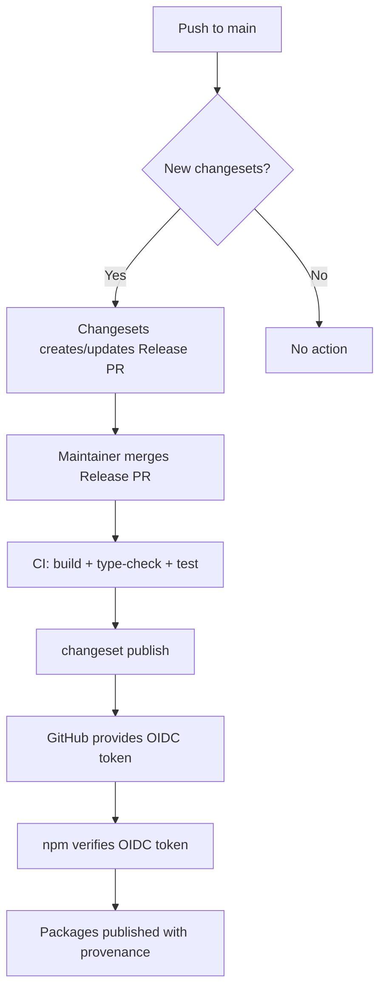

# Connecting Frontal SDKs to NPM

This guide covers the one-time setup to publish `@frontal-labs` packages to the npm
registry using **Trusted Publishing** (OIDC). No long-lived tokens are needed — npm
trusts GitHub Actions directly.

---

## 1. Create the @frontal-labs Organization on npm

1. Log in to [npmjs.com](https://www.npmjs.com/).
2. Click your avatar → **Add Organization**.
3. Create an organization named **`frontal-labs`**.
4. Invite team members who need publish access.

---

## 2. Configure Trusted Publishing

Trusted Publishing links your GitHub repository to the npm package scope so that
GitHub Actions can publish without a long-lived token.

For **each package** you want to publish (repeat per package):

1. Go to the package's npm page:
   `https://www.npmjs.com/package/@frontal-labs/<name>`
   (You may need to publish once manually or use `npm publish` locally to create
   the package first.)

2. Go to **Settings** → **Trusted Publishing** (or **Require two-factor auth
   for automation**) → **Add Trusted Publisher**.

3. Fill in the form:
   | Field | Value |
   |:---|:---|
   | **Registry** | `https://registry.npmjs.org` |
   | **GitHub Owner** | `frontal-labs` |
   | **GitHub Repository** | `sdk-typescript` |
   | **Workflow Path** | `.github/workflows/publish.yml` |
   | **Environment** | *(leave blank)* |

4. Click **Add**.

**Alternatively**, you can set up Trusted Publishing at the **organization level**
to cover all packages under `@frontal-labs` in one step. Go to your organization
on npm → **Settings** → **Trusted Publishing** → add the same GitHub details.
This is the recommended approach for monorepos.

---

## 3. Verify Permissions

The publish workflow (`.github/workflows/publish.yml`) already has the required
permission:

```yaml
permissions:
  id-token: write   # enables OIDC token exchange with npm
  contents: write   # needed for creating GitHub Releases
```

No `NPM_TOKEN` secret is needed. The workflow publishes via Trusted Publishing
only.

---

## 4. How Publishing Works



### Trusted Publishing Flow

1. GitHub Actions requests an OIDC token from the workflow's `id-token: write`
   permission.
2. npm verifies the OIDC token against the Trusted Publisher configuration
   (owner, repo, workflow path).
3. If verified, npm issues a short-lived publish token.
4. The package is published with a provenance statement linking it to this
   exact workflow run.

### Provenance

All packages have `"provenance": true` in their `publishConfig`. Combined with
Trusted Publishing, each published package gets a verifiable provenance
statement showing it was built from this repository by the official workflow.
Consumers see a "Provenance" badge on the package page.

---

## 5. First-Time Publish

For the very first publish, you may need to publish one package manually to
create it on npm (the Trusted Publishing UI only appears once the package
exists). Use a granular Automation token scoped to `@frontal-labs`:

```bash
# One-time only — create the first package
npm publish --access public
```

After the package exists on npm, configure Trusted Publishing on it. All
subsequent publishes go through CI.

If you set up Trusted Publishing at the **organization level**, this
first-time step is not needed — the organization-level trust covers new
packages automatically.

---

## 6. Troubleshooting

| Problem | Likely Cause | Fix |
|:---|:---|:---|
| `401 Unauthorized` in CI | Trusted Publisher not configured | Check owner/repo/workflow match exactly |
| `403 Forbidden` | Token lacks write access | Verify the npm org has the GitHub repo listed |
| Provenance badge missing | Not published from the trusted workflow | Only publishes from the configured workflow path get provenance |
| `id-token` permission denied | Workflow missing permission | Ensure `id-token: write` in the job permissions |
